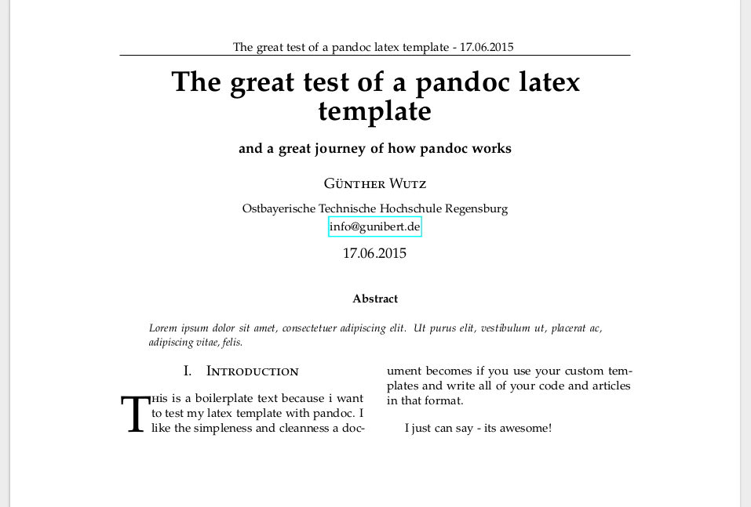

# papertemplate
A academic paper template for pandoc + markdown

## How

Just write a regular markdown file with an yaml header. There are some
unique options for your yaml-file to generate a nice looking academic
paper. Credit for the paper-template goes to
[latextemplates](http://www.latextemplates.com/template/journal-article)

Sample markdownfile: 
    ---
    title: The great test of a pandoc latex template 
    subtitle: and a great journey of how pandoc works 
    author: Günther Wutz 
    university: Ostbayerische Technische Hochschule Regensburg 
    mail: info@gunibert.de 
    date: 17.06.2015 
    abstract: |
       Lorem ipsum dolor sit amet, consectetuer adipiscing
       elit. Ut purus elit, vestibulum ut, placerat ac, adipiscing vitae,
       felis. 
    ---

    # Introduction

    \lettrine[nindent=0em,lines=3]{T} his is a boilerplate text because i want
    to test my latex template with pandoc. I like the simpleness and cleanness
    a document becomes if you use your custom templates and write all of your
    code and articles in that format.

    I just can say - its awesome!

Generates:

